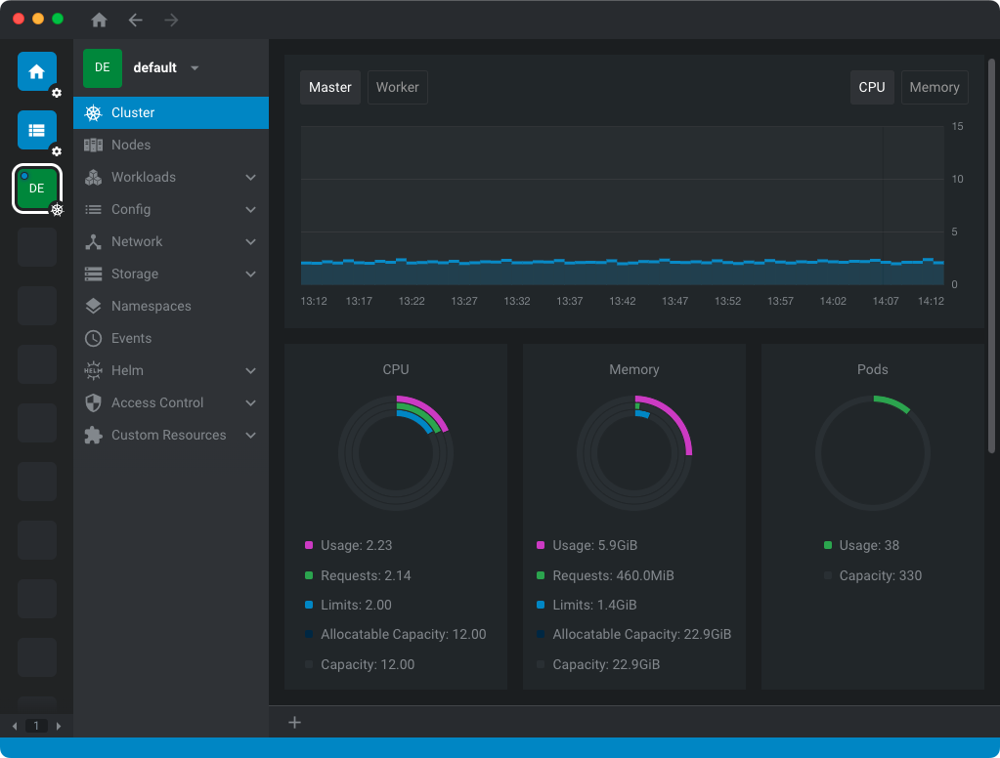

# k3s-cluster

K3S high-availability cluster, deployed with Ansible.



## Hardware

- 8 x Raspberry Pi 4B with 8GB RAM
- 8 x Samsung PM883 240GB SSD, connected to same USB port
- 8 x SLK Tech [Sata to USB cable](https://www.amazon.com/gp/product/B07S9CKV7X/)
- UniFi [UDM-SE](https://store.ui.com/us/en/collections/unifi-dream-machine/products/udm-se) cloud gateway, for dedicated network management
- UniFi [USW-Pro-24-POE](https://store.ui.com/us/en/collections/unifi-switching-pro-power-over-ethernet/products/usw-pro-24-poe) switch, powering the Raspberry Pi's

## Used Technologies

- [ArgoCD](https://argoproj.github.io/cd/)
- [Cilium](https://cilium.io)
- [Cloudflare](https://www.cloudflare.com) Let's Encrypt certificates deployed with [cert-manager](https://cert-manager.io)
- [HAProxy](https://www.haproxy.org) load balancer for controlplanes
- [K3S](https://k3s.io) production ready deployment
- [Longhorn](https://longhorn.io)
- [Prometheus Stack](https://github.com/prometheus-community/helm-charts/tree/main/charts/kube-prometheus-stack)
- [Renovate](https://github.com/renovatebot/renovate)
- [Sealed Secrets](https://github.com/bitnami-labs/sealed-secrets)
- Ubuntu LTS 22.04 OS with unattended upgrades enabled

### TODO

- Automate the k3s cluster upgrades, chart upgrades are functional
- Update Renovate configuration, for automated version upgrades
- Finalize documentation

## Ansible

### Cluster Setup

Install dependencies in MacOS:

```shell
brew install ansible ansible-lint
brew tap esolitos/ipa
brew install esolitos/ipa/sshpass
```

Upgrade [kubernetes.core](https://github.com/ansible-collections/kubernetes.core/blob/main/docs/kubernetes.core.helm_module.rst) [collection](https://docs.ansible.com/ansible/latest/collections_guide/collections_installing.html):

```shell
ansible-galaxy collection install -U kubernetes.core
```

Deploy cluster:

```shell
ansible-playbook --ask-vault-pass provisioning.yaml
```

Reset cluster:

```shell
ansible-playbook --ask-vault-pass reset.yaml
```

### Roles

Each role has their own dedicated README, for additional details and required settings.
