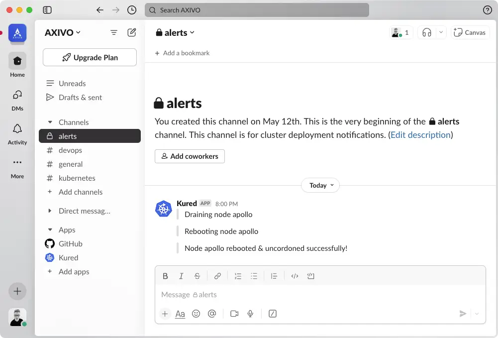

This repository uses [Kured](https://kured.dev), to ensure the cluster nodes are properly rebooted, during a scheduled OS upgrade reboot event.

<!--more-->

## Slack

Slack [notifications](https://kured.dev/docs/configuration/#notifications) can be enabled, allowing end-user to receive notifications when each cluster node is rebooted.

[](kured-slack.webp)

{}

### Slack Application

Create a new [application](https://api.slack.com/apps) from scratch, named `Kured` and assign it to intended workspace where Kured notifications will be received.

### Webhook

Activate [incoming webhooks](https://api.slack.com/messaging/webhooks) and create a new webhook, specifying in what channel Kured will have permissions to post cluster updates. The webhook will have the following format:

```shell
https://hooks.slack.com/services/<token>/<token>/<token>
```

### Notify URL

Encrypt the `slack.notify_url` value with [`ansible-vault`](/k3s-cluster/tutorials/handbook/ansible/#vault) and insert it into 
[`main.yaml`](https:///blob/main/roles/kured/defaults/main.yaml) defaults file. Notify URL pre-encrypted format:

```yaml
notify_url: slack://<token>/<token>/<token>
```

{}
