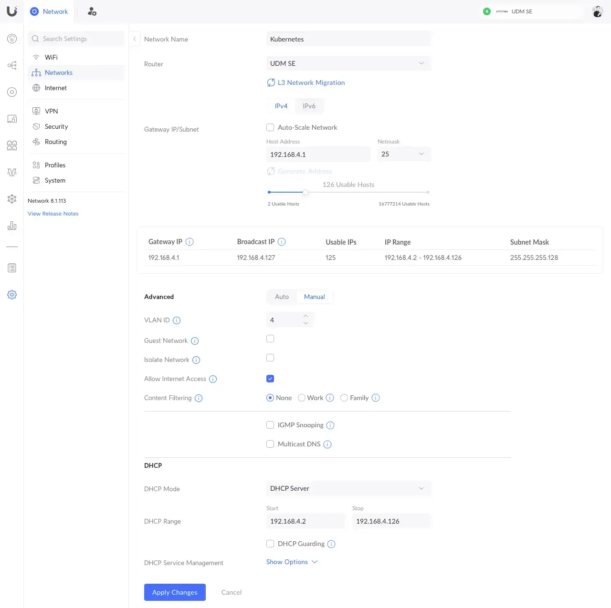
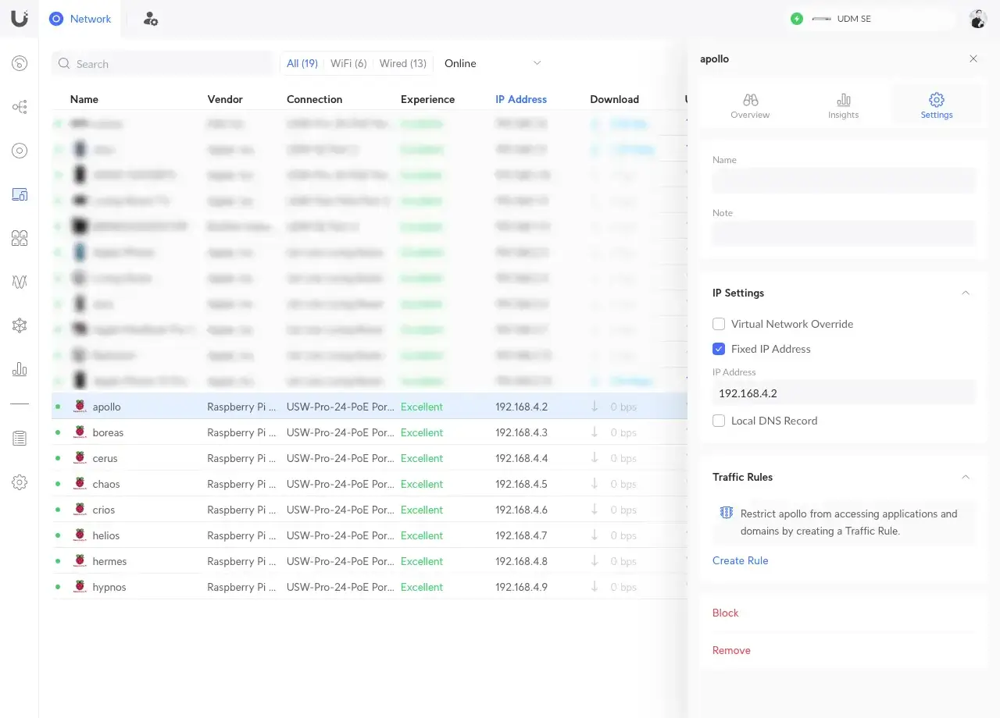

Networking is a central part of [Kubernetes](https://kubernetes.io/docs/concepts/cluster-administration/networking). The Kubernetes network model is implemented by the container runtime on each server node.

<!--more-->

## Configuration

It is strongly recommended to set a dedicated VLAN and static IP addresses for each cluster node, in order to isolate your cluster. Clusters require to allocate non-overlapping IP addresses for Pods, Services and Nodes, from a range of available addresses.

{}

### VLAN

In your router, set a new VLAN with IPv6 disabled:

[](network-vlan.webp)

Into above example, the VLAN ID is set to `4` and the subnet netmask to `25`, allowing you to set up to 125 usable hosts, used for your nodes and Kubernetes external IP services.

### Static IP Address

For each server node, set the static IP address associated with related network interface MAC address:

[](network-static-ip.webp)

### Internet Connectivity

Login into a server node and test the network connectivity with outside world:

```shell
curl -I https://one.one.one.one
```

The expected output should be:

```shell
HTTP/2 200
date: Fri, 03 May 2024 08:18:06 GMT
content-type: text/html; charset=utf-8
cf-ray: 87ded1839bf04bb8-YUL
access-control-allow-origin: *
cache-control: public, max-age=0, must-revalidate
etag: "5dd740d0e716a31c1b8437db0263fa93"
vary: Accept-Encoding
referrer-policy: strict-origin-when-cross-origin
x-content-type-options: nosniff
server: cloudflare
alt-svc: h3=":443"; ma=86400
```

{}
