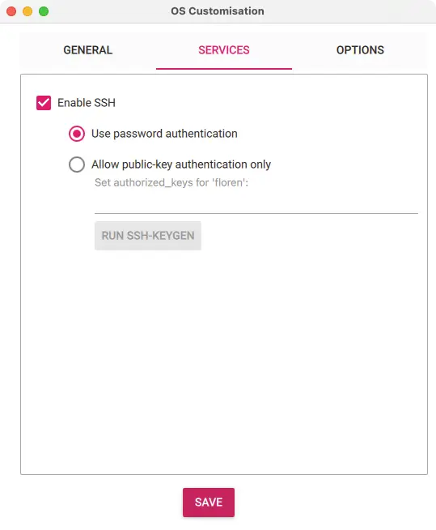

This repository uses Raspberry Pi's as bare-metal hardware, therefore is recommended to install the latest Ubuntu Server LTS `+` (64-bits) OS with Raspberry Pi Imager.

<!--more-->

## OS Installation

Each cluster node uses Ubuntu Server LTS `+` (64-bits) OS installed, which is a requirement for [Cilium](https://cilium.io). The `apt` package dependencies changed, compared to previous `` release, therefore, `+` release is enforced as minimal requirement.

{}

### Software

Run the following command to install the Raspberry Pi Imager software:

```shell
brew install raspberry-pi-imager
```

### OS General Settings

On each cluster node, under `OS Customisation: General` section, set **only** the `hostname`, `username` and `password`, as well the `locale` values:



  Use the `username` defined above to set the [`ansible_username`](/k3s-cluster/wiki/guide/configuration/user) variable.


### OS Services

On each cluster node, under `OS Customisation: Services` section, enable SSH with password authentication:



{}

## Hostname Validation

Depending on what router you use, the `hostname` might not resolve correctly in Ubuntu. Prior cluster deployment, verify the `hostname` FQDN is correctly set.

{}

### Server Login

Login into one of the cluster nodes:

```shell
ssh apollo
```

### Validation

Validate the `/etc/hosts` configuration:

```shell
cat /etc/hosts | grep apollo
```

If the output is as listed below, no action is required:

```shell
127.0.1.1 apollo.local apollo
```


  The [Provisioning](/k3s-cluster/wiki/guide/playbooks/provisioning) playbook will validate on each cluster node if the above format is respected, and correct it if needed.


You can check the detected server node FQDNs, by running:

```shell
hostname --all-fqdns
```

The output should be:

```shell
apollo.local apollo
```

{}
